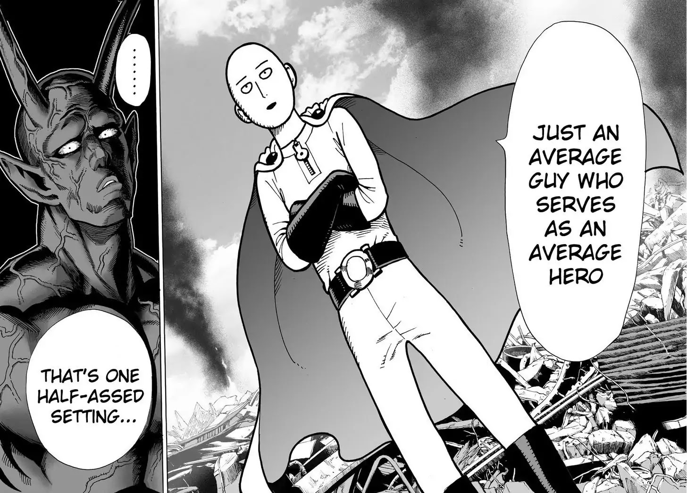
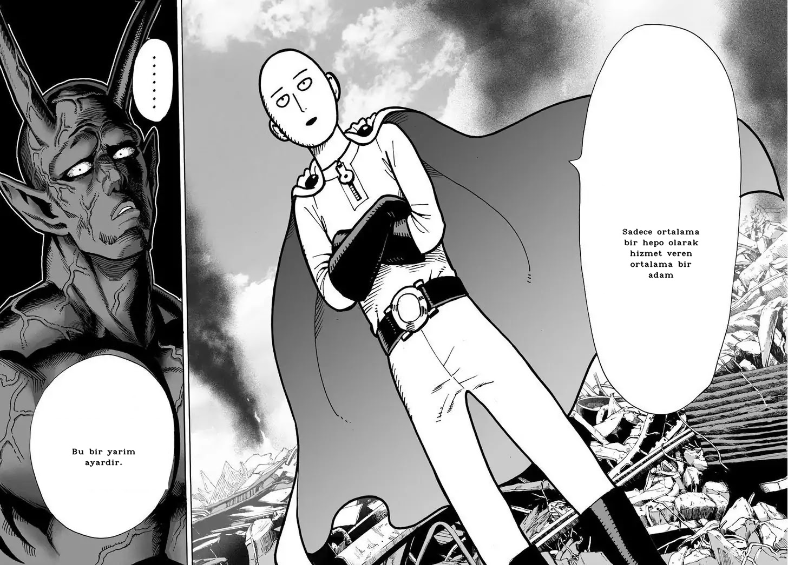
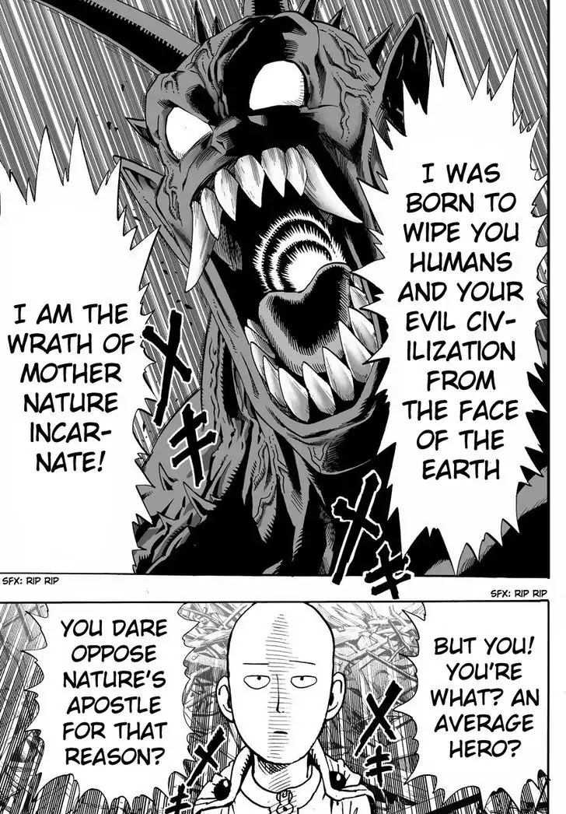
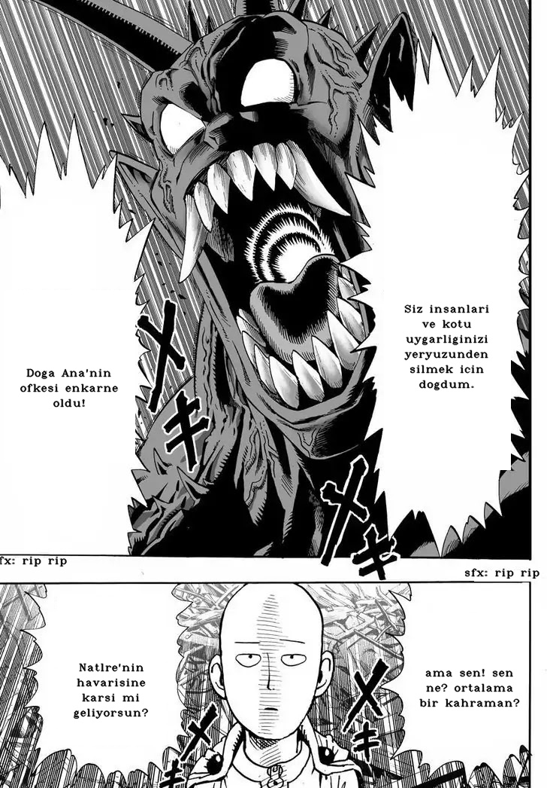
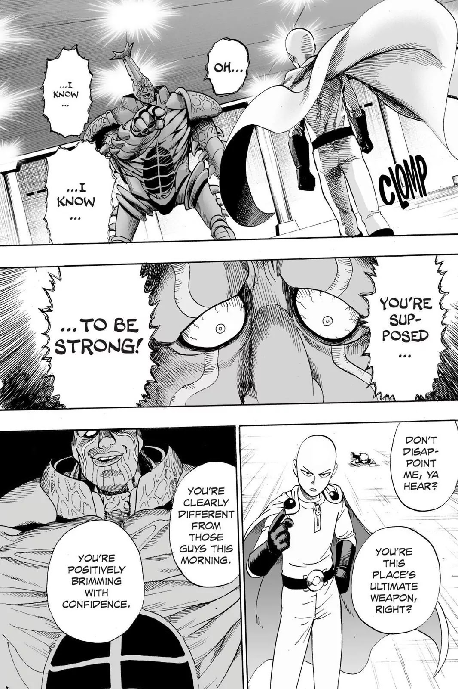
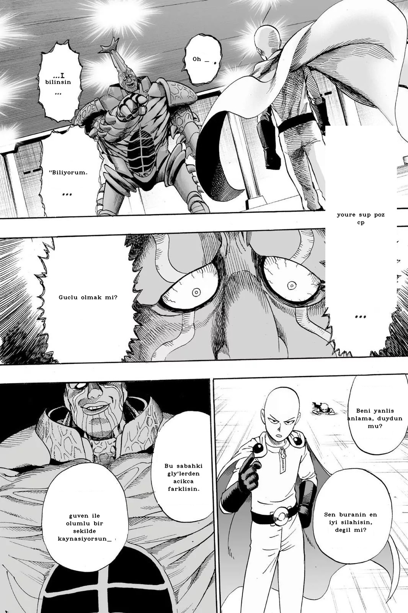

<div align="center">

# Manga & Comic Translator

[](https://www.python.org/)
[](https://github.com/JaidedAI/EasyOCR)
[](https://huggingface.co/transformers/)
[](https://opencv.org/)
[](LICENSE)

### AI-Powered Manga and Comic Translation

Automatically translate manga and comics from any language to any language using OCR and machine translation.

---

**[English](#english)** | **[Türkçe](#turkish)**

</div>

---

## Examples / Örnekler

<table>
  <tr>
    <th>Original (Input) / Orijinal (Giriş)</th>
    <th>Translated (Output) / Çevrilmiş (Çıkış)</th>
  </tr>
  <tr>
    <td></td>
    <td></td>
  </tr>
  <tr>
    <td></td>
    <td></td>
  </tr>
  <tr>
    <td></td>
    <td></td>
  </tr>
</table>

---

## <a name="english"></a>🇬🇧 English

# Manga & Comic Translator with AI

This project uses artificial intelligence to automatically translate manga and comics from one language to another. It combines OCR (Optical Character Recognition) to extract text from images and neural machine translation to provide accurate translations.

## Overview

The translator processes manga or comic images by detecting text areas, extracting the text using EasyOCR, translating it using Hugging Face transformers, and then overlaying the translated text back onto the image. This fully automated pipeline makes it easy to translate entire manga volumes or comic series.

## How It Works

**1. Text Detection**
- Uses EasyOCR to detect and extract text from manga/comic images
- Identifies text regions and their coordinates
- Groups nearby text elements together (speech bubbles, captions)

**2. Text Translation**
- Utilizes Hugging Face Transformers for neural machine translation
- Supports multiple language models (Helsinki-NLP/opus-mt models)
- Preserves text context and meaning during translation

**3. Image Processing**
- Creates white rectangles over original text areas
- Wraps and fits translated text into available space
- Maintains original image layout and aesthetics

**4. Text Overlay**
- Automatically adjusts font size and positioning
- Centers translated text in available space
- Handles multi-line text with proper wrapping

## Features

- **Multi-Language Support** - Translate between various languages using different models
- **Automatic Text Detection** - Smart OCR with EasyOCR
- **Context-Aware Grouping** - Groups related text elements (speech bubbles)
- **Batch Processing** - Process multiple images at once with progress tracking
- **Preserves Layout** - Maintains original manga/comic layout
- **Text Wrapping** - Automatically wraps long translations

## Installation

**Requirements:**
- Python 3.7+
- Required packages:
  ```bash
  pip install easyocr==1.7.1 transformers==4.41.1 opencv-python==4.9.0.80 tqdm==4.66.2 textwrap3==0.9.2
  ```

## Usage

1. Place your manga/comic images in the `manga/` folder

2. Run the translation script:
   ```bash
   python manga_çeviri.py
   ```

3. Translated images will be saved in the `cevri_manga/` folder

**Customization:**

You can change the translation model in the code:
```python
# Change this line to use different language pairs
translator = pipeline(task="translation", model="Helsinki-NLP/opus-mt-tc-big-en-tr")
```

Available models:
- `Helsinki-NLP/opus-mt-en-tr` - English to Turkish
- `Helsinki-NLP/opus-mt-ja-en` - Japanese to English
- `Helsinki-NLP/opus-mt-en-ja` - English to Japanese
- And many more on [Hugging Face](https://huggingface.co/models?filter=translation)

## Technical Details

**Key Functions:**
- `yakın_kelimeleri_bul()` - Groups nearby text elements based on coordinates
- `orta_nokta_bul()` - Finds center point of text regions
- `verileri_düzelt()` - Cleans and formats extracted text
- `translators()` - Performs neural machine translation
- `beyaz_kare_olustur()` - Creates white boxes and overlays translated text

---

## <a name="turkish"></a>🇹🇷 Türkçe

# Yapay Zeka ile Manga ve Çizgi Roman Çevirici

Bu proje, yapay zeka kullanarak mangaları ve çizgi romanları bir dilden diğerine otomatik olarak çevirir. Görüntülerden metin çıkarmak için OCR (Optik Karakter Tanıma) ve doğru çeviriler sağlamak için sinir ağı tabanlı makine çevirisi birleştirir.

## Genel Bakış

Çevirici, manga veya çizgi roman görüntülerini işleyerek metin alanlarını tespit eder, EasyOCR kullanarak metni çıkarır, Hugging Face transformers ile çevirir ve ardından çevrilmiş metni görüntü üzerine geri yerleştirir. Bu tam otomatik işlem hattı, tüm manga ciltlerini veya çizgi roman serilerini çevirmeyi kolaylaştırır.

## Nasıl Çalışır

**1. Metin Tespiti**
- Manga/çizgi roman görüntülerinden metin tespit etmek ve çıkarmak için EasyOCR kullanır
- Metin bölgelerini ve koordinatlarını tanımlar
- Yakındaki metin öğelerini gruplar (konuşma balonları, altyazılar)

**2. Metin Çevirisi**
- Sinir ağı tabanlı makine çevirisi için Hugging Face Transformers kullanır
- Birden fazla dil modelini destekler (Helsinki-NLP/opus-mt modelleri)
- Çeviri sırasında metin bağlamını ve anlamını korur

**3. Görüntü İşleme**
- Orijinal metin alanlarının üzerine beyaz dikdörtgenler oluşturur
- Çevrilmiş metni mevcut alana sığdırır ve sarar
- Orijinal görüntü düzenini ve estetiğini korur

**4. Metin Yerleştirme**
- Yazı tipi boyutunu ve konumlandırmayı otomatik olarak ayarlar
- Çevrilmiş metni mevcut alana ortalar
- Çok satırlı metni uygun şekilde sarar

## Özellikler

- **Çoklu Dil Desteği** - Farklı modeller kullanarak çeşitli diller arasında çeviri yapın
- **Otomatik Metin Algılama** - EasyOCR ile akıllı OCR
- **Bağlam Duyarlı Gruplama** - İlgili metin öğelerini gruplar (konuşma balonları)
- **Toplu İşleme** - İlerleme takibi ile birden fazla görüntüyü aynı anda işleyin
- **Düzeni Korur** - Orijinal manga/çizgi roman düzenini korur
- **Metin Sarma** - Uzun çevirileri otomatik olarak sarar

## Kurulum

**Gereksinimler:**
- Python 3.7+
- Gerekli paketler:
  ```bash
  pip install easyocr==1.7.1 transformers==4.41.1 opencv-python==4.9.0.80 tqdm==4.66.2 textwrap3==0.9.2
  ```

## Kullanım

1. Manga/çizgi roman görüntülerinizi `manga/` klasörüne yerleştirin

2. Çeviri scriptini çalıştırın:
   ```bash
   python manga_çeviri.py
   ```

3. Çevrilmiş görüntüler `cevri_manga/` klasörüne kaydedilecektir

**Özelleştirme:**

Kodda çeviri modelini değiştirebilirsiniz:
```python
# Farklı dil çiftleri kullanmak için bu satırı değiştirin
translator = pipeline(task="translation", model="Helsinki-NLP/opus-mt-tc-big-en-tr")
```

Mevcut modeller:
- `Helsinki-NLP/opus-mt-en-tr` - İngilizce'den Türkçe'ye
- `Helsinki-NLP/opus-mt-ja-en` - Japonca'dan İngilizce'ye
- `Helsinki-NLP/opus-mt-en-ja` - İngilizce'den Japonca'ya
- Ve daha fazlası [Hugging Face](https://huggingface.co/models?filter=translation)'de

## Teknik Detaylar

**Anahtar Fonksiyonlar:**
- `yakın_kelimeleri_bul()` - Koordinatlara göre yakındaki metin öğelerini gruplar
- `orta_nokta_bul()` - Metin bölgelerinin merkez noktasını bulur
- `verileri_düzelt()` - Çıkarılan metni temizler ve formatlar
- `translators()` - Sinir ağı tabanlı makine çevirisi gerçekleştirir
- `beyaz_kare_olustur()` - Beyaz kutular oluşturur ve çevrilmiş metni yerleştirir
